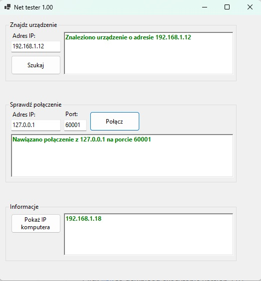
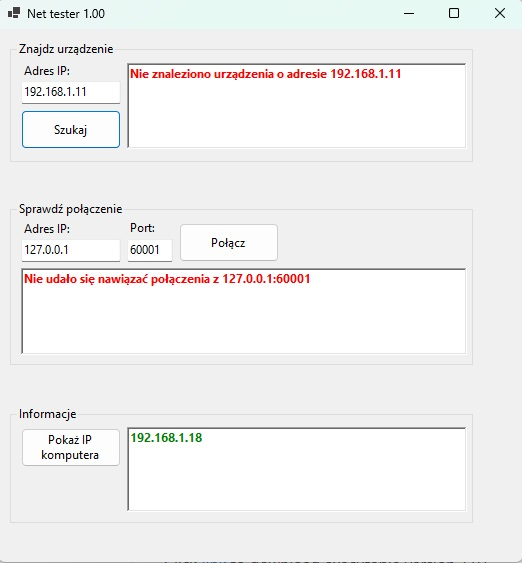
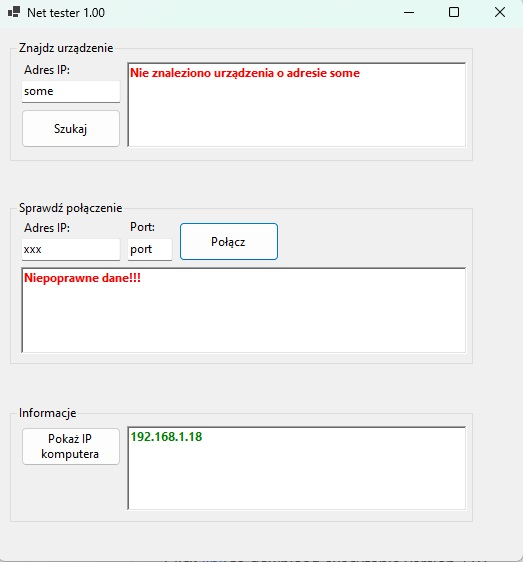

# Net Tester
_My application for scan network_

# Working - in brief
Run NetTester.exe

# Download
Click [link](https://github.com/lukmasko/NetTester/raw/main/NetTester_latest_portable.zip) to download executable version 1.00

# Screen
Scan OK

Scan with error

# Technology stack
 C#
    
# Authors
Łukasz Maśko (lukmasko@gmail.com)

# License
...